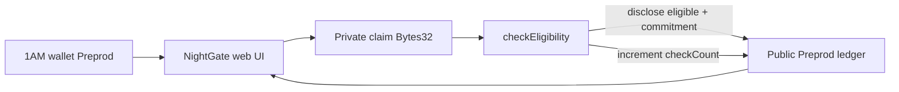

# NightGate

[](https://github.com/manojaggarwal812/night-gate/actions/workflows/ci.yml)

**Prove you meet an eligibility threshold without revealing the underlying private value.**

| | |
|---|---|
| Public repo | https://github.com/manojaggarwal812/night-gate |
| Live demo | https://night-gate-mauve.vercel.app |
| Demo video | [nightgate.mp4 (Google Drive)](https://drive.google.com/file/d/1JluSV3vShfEw2ko9q_1sD74GL8mNO3Uj/view?usp=sharing) |
| Product idea | **Age / Eligibility Gate** ([proposal](docs/evidence/PRODUCT_PROPOSAL.md)) |
| Preprod contract | `17d06850fed3c49058994d4fced343144159b622579e63fc11e4132307948eef` |
| Commits on `main` | ≥25 meaningful |
| Tests | **10 passing** (`npm test`) |
| CI | Passing on every push |

NightGate is a Midnight Compact contract + **1AM** frontend for threshold eligibility checks (age ≥ 18, score ≥ threshold, membership tier). The sensitive value stays in a private witness; observers only see whether the check passed, how many checks ran, and a commitment hash.

## Levels overview

| Level | Theme | Status |
|---|---|---|
| Level 1 — New Moon | Compile, tests, Preview path | ✅ Verified |
| Level 2 — Waxing Crescent | 1AM UI, Preprod, circuit call, live demo | ✅ Verified |
| Level 3 — First Quarter | CI/CD, polish, proposal, screenshots, video | ✅ Verified |
| Idea Submission (L4–6) | Age / Eligibility Gate → Identity/credentials | ✅ Copy ready |

---

## Checklist — Level 1 (New Moon)

| # | Requirement | Status | Where |
|---|---|---|---|
| 1 | New Midnight Compact product (not a clone rename) | ✅ | `contracts/night-gate.compact` |
| 2 | Compact `+0.31.1` managed artifacts | ✅ | `contracts/managed/night-gate/` |
| 3 | ≥3 tests passing | ✅ | **10** Vitest (`tests/`) |
| 4 | Compile / artifact evidence | ✅ | `docs/screenshots/compile-*` |
| 5 | Public GitHub repo | ✅ | manojaggarwal812/night-gate |
| 6 | README with product + privacy claim | ✅ | This file |
| 7 | ≥5 meaningful commits | ✅ | 25+ on `main` |
| 8 | MIT license | ✅ | `LICENSE` |

---

## Checklist — Level 2 (Waxing Crescent)

| # | Requirement | Status | Where |
|---|---|---|---|
| 1 | Frontend dApp wired to deployed contract | ✅ | `web/` + Preprod address |
| 2 | Wallet connect / disconnect | ✅ | 1AM (`selectWallet` + topbar) |
| 3 | Circuit call from UI | ✅ | `Call checkEligibility` |
| 4 | Privacy UX (public eligible/count/commitment only) | ✅ | Public ledger panel + score cleared |
| 5 | Preprod contract address | ✅ | `17d06850…948eef` |
| 6 | Live demo URL | ✅ | https://night-gate-mauve.vercel.app |
| 7 | Demo video | ✅ | [Drive](https://drive.google.com/file/d/1JluSV3vShfEw2ko9q_1sD74GL8mNO3Uj/view?usp=sharing) |
| 8 | ≥8 meaningful commits | ✅ | 25+ |
| 9 | README privacy model | ✅ | Section below |
| 10 | `dapp-connector-api` + midnight-js providers | ✅ | `web/src/lib/providers.ts` |

---

## Checklist — Level 3 (First Quarter)

| # | Requirement | Status | Where |
|---|---|---|---|
| 1 | Fully functional privacy dApp | ✅ | Live + Preprod |
| 2 | ≥3 tests passing | ✅ | **10** tests |
| 3 | CI/CD workflow + passing runs | ✅ | [Actions](https://github.com/manojaggarwal812/night-gate/actions/workflows/ci.yml) |
| 4 | Idea from provided list | ✅ | **Age / Eligibility Gate** |
| 5 | Product proposal for approval | ✅ | [PRODUCT_PROPOSAL.md](docs/evidence/PRODUCT_PROPOSAL.md) |
| 6 | ≥10 meaningful commits | ✅ | 25+ |
| 7 | Public GitHub + complete README | ✅ | This repo |
| 8 | Live demo link | ✅ | Vercel |
| 9 | Test output screenshot | ✅ | `docs/screenshots/test-results.png` |
| 10 | Desktop + mobile screenshots | ✅ | `docs/screenshots/*-live.png` |
| 11 | Demo video (1 min) | ✅ | [Drive](https://drive.google.com/file/d/1JluSV3vShfEw2ko9q_1sD74GL8mNO3Uj/view?usp=sharing) |
| 12 | Privacy model section | ✅ | Below |
| 13 | Code quality audit | ✅ | [CODE_QUALITY.md](docs/evidence/CODE_QUALITY.md) |

**Self-verify run (2026-09-30):** `npm test` → 10/10 · `npm --prefix web run build` → OK · latest CI → **success**.

---

## Screenshots

### Desktop live demo


### Mobile responsive (390×844)


### Tests — 10 passing


---

## Privacy model — what an observer can and cannot learn

| Data | Visibility | Where it lives | Notes |
|---|---|---|---|
| Private claim (`Bytes<32>`) | **PRIVATE** (witness) | Prover / 1AM session | First 8 bytes = LE `u64` score/age. Never cleartext on ledger. |
| Circuit `score` param | **PRIVATE** | Circuit witness | Matches claim encoding. |
| `eligible` | **PUBLIC** after `disclose()` | Ledger | Boolean `score >= 18`. |
| `checkCount` | **PUBLIC** | Ledger `Counter` | Increments on every `checkEligibility`. |
| `latestCommitment` | **PUBLIC** after `disclose()` | Ledger | `persistentHash(claim)` — commitment, not the value. |

**Observer learns:** that a check ran, whether the threshold was met, a commitment hash, and the count of checks.  
**Observer cannot learn:** the raw age/score/tier value.

## Architecture



## Requirements

- Node.js 22+
- Compact CLI `+0.31.1` (WSL on Windows: `npm run compile:wsl`)
- Midnight.js **4.1.1** + **1AM** on Preprod
- Proving: `@midnight-ntwrk/midnight-js-dapp-connector-proof-provider` (HTTP proof-server fallback)

## Quick start

```bash
npm install
npm run compile:wsl   # or npm run compile on Linux/macOS
npm test
npm run web:sync-zk
npm run web:dev
```

Open http://localhost:5173 — Connect **1AM** → Join (auto) → private score → **Call checkEligibility**.

## CI/CD

On every push / PR to `main` (`.github/workflows/ci.yml`):

1. `npm ci`
2. `npm test`
3. `npm run web:sync-zk`
4. `npm --prefix web ci && npm --prefix web run build`

## Preprod deployment

| Field | Value |
|---|---|
| Contract | `17d06850fed3c49058994d4fced343144159b622579e63fc11e4132307948eef` |
| Deploy tx | `7bd6c5da8a3459b4ca34d28fce1512abb7ac9719d4935b3bec6b0e5683432f3d` |
| Block | `2765705` |
| Evidence | [DEPLOYMENT.md](docs/evidence/DEPLOYMENT.md) |

## Idea Submission (form paste)

See [PRODUCT_PROPOSAL.md](docs/evidence/PRODUCT_PROPOSAL.md):

- **Idea:** Age / Eligibility Gate — NightGate  
- **Category:** Identity/credentials  
- **Period:** September Challenge (Active)

## Project layout

```
night-gate/
  .github/workflows/ci.yml
  contracts/night-gate.compact
  contracts/managed/night-gate/
  web/
  src/
  tests/
  docs/evidence/
  docs/screenshots/
```

## License

MIT © 2026 Manoj Aggarwal
