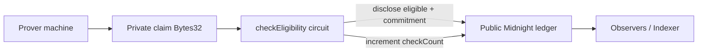
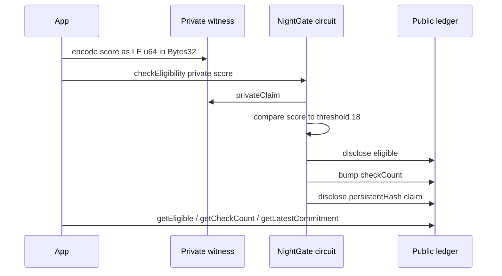

# NightGate

**Prove you meet an eligibility threshold without revealing the underlying private value.**

NightGate is a Midnight Compact contract for threshold eligibility checks (age ≥ 18, score ≥ 70, membership tier ≥ X). The sensitive value stays in a private witness; observers only see whether the check passed, how many checks ran, and an optional commitment hash.

This repository is the **Level 1 — New Moon** submission for the New Moon to Full program: compile, test, Preview deploy evidence, and a public GitHub repo. No Lace frontend, no Vercel — those belong to later levels.

## Initial product idea

Apps constantly ask “is this user eligible?” — old enough, high enough score, paid enough tier — but putting the raw number on a public ledger leaks personal data. Zero-knowledge circuits can answer the boolean without disclosing the inputs.

NightGate models that pattern as a single Compact contract. A prover supplies a 32-byte private claim (first 8 bytes = little-endian `u64` score/age) plus a matching private circuit parameter. The circuit compares against a documented threshold constant (`18` for this demo), discloses only `eligible`, bumps a public counter, and stores `persistentHash(claim)` so the ledger can attest that a check happened without revealing the value.

Under-threshold callers are **allowed**: the call succeeds with `eligible = false` so demos and tests stay simple. Later levels can harden policy (reject under-threshold, multi-field claims, wallet UX).

The long-term product vision is an Age / Eligibility Gate that any dApp can call before gated actions — still without ever writing cleartext ages or scores to the public Midnight ledger.

## Public vs private

| Data | Visibility | Where it lives | Notes |
|---|---|---|---|
| Private claim (`Bytes<32>`) | **PRIVATE** (witness) | Prover machine only | First 8 bytes = LE `u64` score/age. Never cleartext on ledger. |
| Circuit `score` param | **PRIVATE** | Circuit witness | Must match the claim encoding used by TypeScript witnesses. |
| `eligible` | **PUBLIC** after `disclose()` | Ledger | Boolean result of `score >= 18`. |
| `checkCount` | **PUBLIC** | Ledger `Counter` | Increments on every `checkEligibility` call. |
| `latestCommitment` | **PUBLIC** after `disclose()` | Ledger `Bytes<32>` | `persistentHash(privateClaim)` — commitment, not the value. |

## Architecture





## Requirements

- **Node.js 22+**
- **Compact CLI 0.31.1** pinned via `compact compile +0.31.1 …`
- Compact **language 0.23**, `@midnight-ntwrk/compact-runtime@0.16.0`
- Midnight.js **4.1.1** packages for Preview deploy wiring
- **Docker** for the local proof-server on `:6300` (`docker compose up -d`)
- **Windows:** Compact CLI expects Linux semantics — use `npm run compile:wsl` (WSL)

## Encoding rule

Private claim is exactly 32 bytes:

1. Bytes `[0..8)` — little-endian unsigned 64-bit score/age
2. Remaining bytes — padding / domain tag (not secret)

Threshold constant in circuit: **`18`**. If `score < 18`, the call still succeeds and public `eligible` becomes `false`.

## Quick start

```bash
npm install
# Windows:
npm run compile:wsl
# Linux/macOS (with Compact 0.31.1 on PATH):
npm run compile

npm test

# Optional local proof server for deploy/smoke
docker compose up -d
npm run deploy:preview
```

Deploy needs a funded Preview unshielded address (`MIDNIGHT_SEED` in a local `.env` — never commit). See [docs/evidence/DEPLOYMENT.md](docs/evidence/DEPLOYMENT.md).

## Project layout

```
night-gate/
  contracts/night-gate.compact
  contracts/managed/night-gate/   # committed compile artifacts
  src/witnesses.ts
  src/network.ts
  src/utils.ts
  src/deploy.ts
  tests/night-gate.test.ts
  docs/evidence/
  docs/screenshots/
  docker-compose.yml
  package.json
  README.md
  LICENSE
```

## Circuits

| Circuit | Kind | Purpose |
|---|---|---|
| `checkEligibility(score)` | impure | Read private claim, disclose eligible + commitment, bump count |
| `getCheckCount()` | impure | Read public check counter |
| `getEligible()` | impure | Read public eligible flag |
| `getLatestCommitment()` | impure | Read latest commitment hash |

Witness: `privateClaim(): Bytes<32>`.

## Preview contract address

**`PENDING_PREVIEW_DEPLOY`** — Preview deploy path is implemented; live submit blocked by Preview RPC WebSocket disconnect during wallet sync. Details: [docs/evidence/DEPLOYMENT.md](docs/evidence/DEPLOYMENT.md).

Re-run when Preview sync is healthy:

```bash
docker compose up -d
MIDNIGHT_SEED=<64-hex> npm run deploy:preview
```

## Evidence checklist — Level 1 — New Moon

- [x] Toolchain: Node 22+, Compact `+0.31.1`, runtime 0.16
- [x] `npm run compile` / `compile:wsl` produces `contracts/managed/night-gate/{compiler,contract,keys,zkir}`
- [x] Compile evidence under `docs/screenshots/compile-evidence.html`
- [x] Contract `contracts/night-gate.compact` + `src/witnesses.ts`
- [x] Vitest suite ≥3 tests (artifacts, keys, runtime ledger) — `npm test` green
- [x] Preview deploy wiring (`src/deploy.ts`, `src/network.ts`, docker proof-server)
- [x] Preview deployment recorded in `docs/evidence/DEPLOYMENT.md` (address pending — RPC sync blocker documented)
- [x] Deploy attempt evidence under `docs/screenshots/deploy-evidence.html` and `docs/evidence/`
- [x] Public GitHub repository on `main` with meaningful commits
- [x] README privacy table + mermaid + Level 1 checklist only
- [x] MIT license
- [x] No secrets committed

## License

MIT © 2026 Manoj Aggarwal

## Next: Level 2 — Waxing Crescent

Wallet UX (Lace / 1AM), richer eligibility policies, and a small interactive frontend — not in this Level 1 scope.
