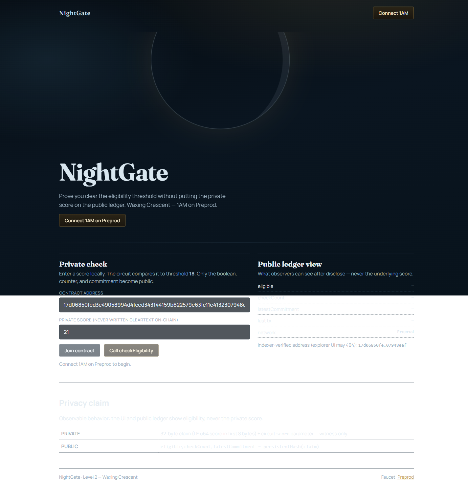
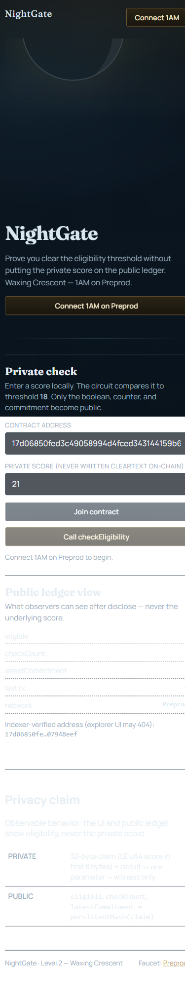
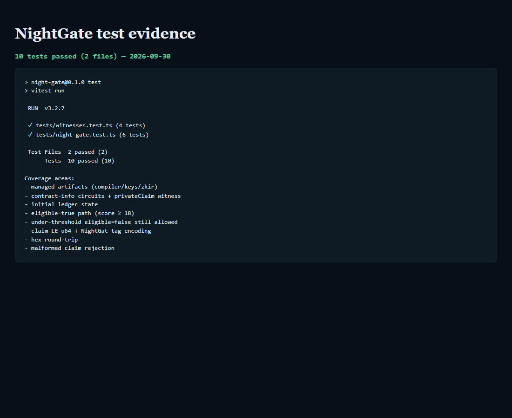
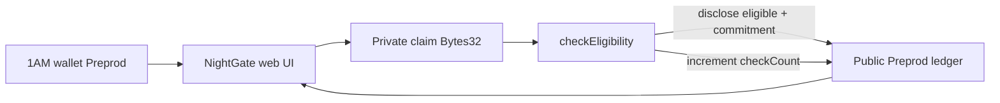

# NightGate

[](https://github.com/manojaggarwal812/night-gate/actions/workflows/ci.yml)

**Prove you meet an eligibility threshold without revealing the underlying private value.**

| | |
|---|---|
| Public repo | https://github.com/manojaggarwal812/night-gate |
| Live demo | https://night-gate-mauve.vercel.app |
| Demo video | [nightgate.mp4 (Google Drive)](https://drive.google.com/file/d/1JluSV3vShfEw2ko9q_1sD74GL8mNO3Uj/view?usp=sharing) |
| Product idea | **Age / Eligibility Gate** ([proposal](docs/evidence/PRODUCT_PROPOSAL.md)) |
| Preprod contract | `17d06850fed3c49058994d4fced343144159b622579e63fc11e4132307948eef` |

NightGate is a Midnight Compact contract + **1AM** frontend for threshold eligibility checks (age ≥ 18, score ≥ threshold, membership tier). The sensitive value stays in a private witness; observers only see whether the check passed, how many checks ran, and a commitment hash.

## Levels

| Level | Status |
|---|---|
| Level 1 — New Moon | Done |
| Level 2 — Waxing Crescent | Done |
| Level 3 — First Quarter (tests, CI/CD, polished dApp, idea) | Done |
| Idea Submission (Level 4–6 track) | Ready — paste from [PRODUCT_PROPOSAL.md](docs/evidence/PRODUCT_PROPOSAL.md) |

## Screenshots

### Desktop live demo



### Mobile responsive (390×844)



### Tests — 10 passing



More evidence: [docs/screenshots/](docs/screenshots/) · raw log: [test-output.txt](docs/screenshots/test-output.txt)

## Privacy model — what an observer can and cannot learn

| Data | Visibility | Where it lives | Notes |
|---|---|---|---|
| Private claim (`Bytes<32>`) | **PRIVATE** (witness) | Prover / 1AM session | First 8 bytes = LE `u64` score/age. Never cleartext on ledger. |
| Circuit `score` param | **PRIVATE** | Circuit witness | Matches claim encoding. |
| `eligible` | **PUBLIC** after `disclose()` | Ledger | Boolean `score >= 18`. |
| `checkCount` | **PUBLIC** | Ledger `Counter` | Increments on every `checkEligibility`. |
| `latestCommitment` | **PUBLIC** after `disclose()` | Ledger | `persistentHash(claim)` — commitment, not the value. |

**Observer learns:** that a check ran, whether the threshold was met, a commitment hash, and the count of checks.  
**Observer cannot learn:** the raw age/score/tier value.

## Architecture



## Requirements

- Node.js 22+
- Compact CLI `+0.31.1` (WSL on Windows: `npm run compile:wsl`)
- Midnight.js **4.1.1** + **1AM** on Preprod
- Proving: `@midnight-ntwrk/midnight-js-dapp-connector-proof-provider` (HTTP proof-server fallback)

## Quick start

```bash
npm install
npm run compile:wsl   # or npm run compile on Linux/macOS
npm test
npm run web:sync-zk
npm run web:dev
```

Open http://localhost:5173 — Connect **1AM** → Join (auto) → private score → **Call checkEligibility**.

## CI/CD

GitHub Actions (`.github/workflows/ci.yml`) on every push / PR to `main`:

1. `npm ci`
2. `npm test` (contract + witness suite)
3. `npm run web:sync-zk`
4. `npm --prefix web ci && npm --prefix web run build`

Badge at the top of this README reflects the latest run:  
https://github.com/manojaggarwal812/night-gate/actions/workflows/ci.yml

## Preprod deployment

| Field | Value |
|---|---|
| Contract | `17d06850fed3c49058994d4fced343144159b622579e63fc11e4132307948eef` |
| Deploy tx | `7bd6c5da8a3459b4ca34d28fce1512abb7ac9719d4935b3bec6b0e5683432f3d` |
| Block | `2765705` |
| Evidence | [DEPLOYMENT.md](docs/evidence/DEPLOYMENT.md) |

## Evidence — Level 3 checklist

- [x] Fully functional privacy dApp on Preprod
- [x] ≥3 tests passing (Vitest — contract + witnesses)
- [x] CI/CD workflow + badge
- [x] Chosen idea: Age / Eligibility Gate — [PRODUCT_PROPOSAL.md](docs/evidence/PRODUCT_PROPOSAL.md)
- [x] ≥10 meaningful commits
- [x] Public GitHub + privacy model section
- [x] Live demo link
- [x] Screenshots: desktop / mobile / tests — `docs/screenshots/`
- [x] Demo video — [Drive link](https://drive.google.com/file/d/1JluSV3vShfEw2ko9q_1sD74GL8mNO3Uj/view?usp=sharing)
- [x] Product proposal drafted for Idea Submission form

## Project layout

```
night-gate/
  .github/workflows/ci.yml
  contracts/night-gate.compact
  contracts/managed/night-gate/
  web/                 # Vite + React 1AM DApp
  src/                 # witnesses, deploy helpers
  tests/
  docs/evidence/
  docs/screenshots/
```

## License

MIT © 2026 Manoj Aggarwal
