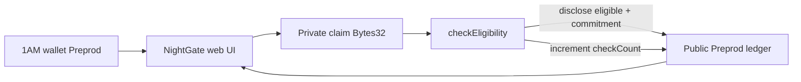
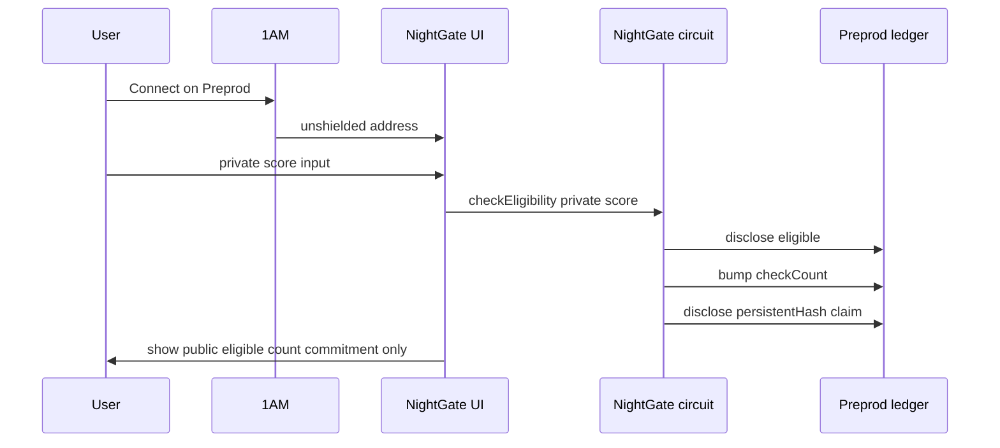

# NightGate

**Prove you meet an eligibility threshold without revealing the underlying private value.**

Public repo: https://github.com/manojaggarwal812/night-gate  
Live demo: https://night-gate-mauve.vercel.app

NightGate is a Midnight Compact contract + **1AM** frontend for threshold eligibility checks (age ≥ 18, score ≥ 70, membership tier ≥ X). The sensitive value stays in a private witness; observers only see whether the check passed, how many checks ran, and a commitment hash.

## Levels

| Level | Status |
|---|---|
| Level 1 — New Moon (compile, tests, Preview path) | Done |
| Level 2 — Waxing Crescent (1AM UI on Preprod, circuit call, live demo) | Done |

## Initial product idea

Apps constantly ask “is this user eligible?” — old enough, high enough score, paid enough tier — but putting the raw number on a public ledger leaks personal data. Zero-knowledge circuits can answer the boolean without disclosing the inputs.

NightGate models that pattern as a Compact contract with a thin Preprod frontend. A prover supplies a 32-byte private claim (first 8 bytes = little-endian `u64` score/age) plus a matching private circuit parameter. The circuit compares against threshold **18**, discloses only `eligible`, bumps a public counter, and stores `persistentHash(claim)`.

Under-threshold callers are **allowed**: the call succeeds with `eligible = false` so demos and tests stay simple. The UI clears the score field after a successful call so the private value is not left on screen.

## Public vs private

| Data | Visibility | Where it lives | Notes |
|---|---|---|---|
| Private claim (`Bytes<32>`) | **PRIVATE** (witness) | Prover / 1AM session | First 8 bytes = LE `u64` score/age. Never cleartext on ledger. |
| Circuit `score` param | **PRIVATE** | Circuit witness | Must match claim encoding. |
| `eligible` | **PUBLIC** after `disclose()` | Ledger | Boolean `score >= 18`. |
| `checkCount` | **PUBLIC** | Ledger `Counter` | Increments on every `checkEligibility`. |
| `latestCommitment` | **PUBLIC** after `disclose()` | Ledger | `persistentHash(claim)` — commitment, not the value. |

## Architecture





## Requirements

- Node.js 22+
- Compact CLI `+0.31.1` (WSL on Windows: `npm run compile:wsl`)
- `@midnight-ntwrk/compact-runtime@0.16.0`, Midnight.js **4.1.1**
- **1AM** browser wallet on **Preprod** ([1am.xyz](https://1am.xyz)) — Lace also works as fallback
- Optional local Docker proof-server on `:6300` (not required when 1AM supplies `proverServerUri`)

## Quick start

```bash
npm install
npm run compile:wsl   # or npm run compile on Linux/macOS
npm test
npm run web:sync-zk
npm run web:dev
```

Open http://localhost:5173 — Connect **1AM** (Preprod) → Deploy or Join → enter private score → Call `checkEligibility`.

1AM injects at `window.midnight['1am']`, sponsors proving/DUST via its prover, and does not require a local Docker proof-server for typical flows ([1AM developers](https://1am.xyz/developers)).

CLI deploy (optional; **1AM UI deploy** is preferred for Level 2):

```bash
docker compose up -d
MIDNIGHT_NETWORK=preprod MIDNIGHT_SEED=<64-hex> npm run deploy:preprod
```

## Project layout

```
night-gate/
  contracts/night-gate.compact
  contracts/managed/night-gate/
  web/                 # Vite + React 1AM DApp
  src/                 # witnesses, deploy helpers
  tests/
  docs/evidence/
  docs/screenshots/
```

## Circuits

| Circuit | Purpose |
|---|---|
| `checkEligibility(score)` | Prove threshold; disclose eligible + commitment; bump count |
| `getCheckCount()` | Read public counter |
| `getEligible()` | Read public flag |
| `getLatestCommitment()` | Read commitment |

## Preprod contract address

| Field | Value |
|---|---|
| Contract | `17d06850fed3c49058994d4fced343144159b622579e63fc11e4132307948eef` |
| Deploy tx | `7bd6c5da8a3459b4ca34d28fce1512abb7ac9719d4935b3bec6b0e5683432f3d` |
| Block | `2765705` |
| Network | Preprod |
| Deployer | 1AM (browser) |

Verified via Preprod indexer `contractAction` → `ContractDeploy`. Night Scan explorer pages may 404; prefer indexer evidence in [docs/evidence/DEPLOYMENT.md](docs/evidence/DEPLOYMENT.md).

Live demo prefills this address for **Join contract**.

## Evidence checklist — Level 2 — Waxing Crescent

- [x] 1AM connect / disconnect in UI (Lace fallback)
- [x] Circuit call path from frontend (`checkEligibility`)
- [x] Observable privacy behavior (public eligible/count/commitment only; score cleared after prove)
- [x] Preprod contract deployed via 1AM; address + tx recorded (see table above)
- [x] Public GitHub repository + README privacy claim
- [x] Live demo (Vercel) — see `docs/evidence/LIVE_DEMO.md`
- [x] Demo video instructions — see `docs/evidence/DEMO_VIDEO.md`
- [x] Minimum 8 meaningful commits on `main`
- [x] Vitest suite still green (Level 1 contract tests)

## Level 1 checklist (still true)

- [x] Compact `+0.31.1` managed artifacts
- [x] Compile evidence under `docs/screenshots/`
- [x] ≥3 Vitest tests
- [x] MIT license

## License

MIT © 2026 Manoj Aggarwal

## Next: Level 3 — First Quarter

Richer wallet UX, monitoring, and hardened eligibility policies — not claimed here.
